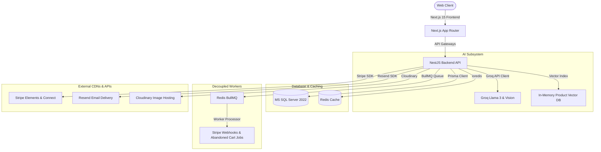

# APEX LUXE

<p align="center">
  
  
  
  
  
  
  
  
  
</p>

<p align="center">
  
</p>

---

## 🌐 Project Overview

**APEX LUXE** is a premium, enterprise-grade multi-tenant luxury sportswear and lifestyle commerce ecosystem. It blends next-generation artificial intelligence with high-scale SaaS architectures to create a unified platform where tenants can deploy fully branded storefronts, independent vendors can sell through a shared marketplace, and customers enjoy highly personalized, real-time interactive shopping experiences.

### The Business Vision
1. **AI-Driven Personalization (Stitch Intelligence)**: Going beyond simple product recommendations by analyzing user outfit uploads, extracting aesthetics (e.g., *Minimalist Techwear*), and offering dialog-driven AI stylists.
2. **Multi-Tenant SaaS (Apex Cloud)**: Supporting custom subdomains, branding options (themes, locales), and distinct billing tiers (Basic, Pro, Enterprise) on a single shared codebase.
3. **Marketplace Ecosystem**: Enabling vendor registration, automated payout configurations via Stripe Connect, and detailed commission calculations.
4. **Global Commerce (Multi-Currency & Warehouses)**: Powering smart order routing across warehouses based on real-time stock levels, localized regional pricing, and automated tax calculations.
5. **Enterprise Reliability**: Engineered with robust retry mechanisms, resilient background processing queues, and micro-hydration optimizations for SSR stability.

---

## ⚠️ Problem & Solution

### The Problem
* **Traditional E-Commerce Limitations**: Standard systems rely on static catalogs, rigid categories, and generic filters, creating a flat and unengaging shopping experience.
* **Lack of Real-Time Personalization**: Common recommendation engines rely strictly on collaborative filtering, ignoring visual style dynamics and conversational shopping preferences.
* **SaaS Scalability & Isolation**: Developing multi-tenant architectures often leads to either costly single-tenant database deployments or risky multi-tenant databases prone to data leakage.
* **Marketplace Friction**: Managing split vendor orders, commissions, shipping thresholds, and Connect payouts introduces massive logistical and development complexity.

### The Solution (APEX LUXE)
* **Visual & Conversational AI Hub**: Integration of Groq Cloud LLM and Vision models to analyze customer outfits, evaluate sportswear compatibility, and host contextual stylist chat sessions.
* **Strict Tenant Data Isolation**: Active database query interception that auto-injects tenant scopes into Prisma queries, backed by pre-flight upsert validation to prevent cross-tenant modifications.
* **Split Fulfillment & Connect Payouts**: Automated order routing to corresponding warehouses and automatic calculations of vendor payouts based on category commission rates.
* **Resilient Infrastructure**: Backed by Microsoft SQL Server for robust transactions, Redis for fast-access caching, and BullMQ for reliable, decoupled background webhook and email queues.

---

## 🏗️ Technical Architecture

APEX LUXE uses a modular, decoupled architecture optimized for performance, security, and high availability.



### Stack Details
* **Frontend**: Next.js 15 (App Router), React 19, TypeScript, TailwindCSS, Zustand (State Management), TanStack React Query.
* **Backend**: NestJS 11 (Enterprise Node.js framework), Prisma ORM, TypeScript, class-validator.
* **Data Layer**: Microsoft SQL Server 2022, Redis (Cache & Session), BullMQ (Background Job Queue).
* **AI Engine**: Groq SDK (Llama 3 70B & Vision models), Custom Product Vector Embeddings.
* **Integrations**: Stripe Elements, Stripe Connect, Resend (Transactional Email), Cloudinary (Image CDN), Firebase Admin (PWA Push Notifications).

---

## 📈 Feature Matrix

| Domain | Feature | Description | Status |
|---|---|---|---|
| **Core Commerce** | catalog | Infinite scroll catalog, multi-criteria filtering, reviews, search, and wishlist. | ✅ |
| | shopping cart | Local client storage sync, regional stock validation, and promotional coupons. | ✅ |
| | checkout | Real-time shipping costs and regional tax calculations with Stripe Elements. | ✅ |
| **AI Systems** | AI Stylist | Visual outfit analysis, overall style scoring, aesthetic classifications, and stylist chat. | ✅ |
| | Smart Catalog | Automated AI semantic tag extraction and compatibility ratings. | ✅ |
| | Recommendations | Multi-engine recommender (Complete-The-Look, Style Affinity, and Personalized Promos). | ✅ |
| **SaaS Platform** | Multi-Tenant | Auto subdomain routing, tenant branding settings, and Stripe-billed SaaS subscriptions. | ✅ |
| | Isolation | Security middleware scoping queries by active tenant domains. | ✅ |
| **Marketplace** | Vendors | Independent vendor registration, split-order handling, and Stripe Connect payouts. | ✅ |
| **Customer Retention**| Loyalty | Automated point awards based on checkout total and custom reward redemptions. | ✅ |
| | Referrals | Referral links, coupon rewards, and conversion tracking on referred purchases. | ✅ |
| | Notifications | Multi-channel notifications (Price drops, low stock, abandoned cart alerts). | ✅ |

---

## 🛠️ AI Subsystems & Deep Learning Scoping

APEX LUXE implements an advanced suite of AI features that coordinate together to drive retail conversions:

1. **AI Stylist (Vision)**: Customers upload images of their current outfits. The Vision API extracts detected colors, layer structures, style aesthetics (e.g., *Athletic Luxury*), sportswear compatibility, and returns an overall score out of 100 with recommended additions.
2. **Contextual Outfit Chat**: Users converse with a custom AI Assistant about their style. The assistant references past outfit analyses, user preferences, and recommends real catalog items dynamically.
3. **Semantic Product Vector DB**: Custom vector indexing that allows users to perform visual searches and maps item compatibility based on stylistic attributes.
4. **Catalog Auto-Tagging**: Reads product descriptions and metadata, automatically generating style classifications, sensory feel tags, and use cases.
5. **Abandoned Cart Retention Engine**: Decoupled BullMQ worker that monitors cart inactivity and sends personalized, AI-crafted promotion emails to recapture customers.

---

## 🏁 Challenges & Engineering Decisions

During the development of APEX LUXE, several high-impact engineering challenges were solved to achieve a production-ready state:

### 1. React 19 Hydration Mismatches & SSR/CSR Instability
* **The Challenge**: Server-side rendering dynamic components (like currency conversions, locale toggles, and theme states) caused frequent hydration mismatches because the server-generated markup differed from client state on mount.
* **The Resolution**: Implemented a global custom `useMounted` guard that defers client-only rendering elements until the component is mounted. Encapsulated non-deterministic elements (such as `Date.now()`, locale settings, and dynamic IDs) within `useEffect` wrappers.

### 2. High-Latency LLM Inference & Timeouts
* **The Challenge**: Querying LLMs for real-time stylist responses and vision analysis led to latencies of 4-10 seconds, blocking thread loops or causing client-side HTTP timeouts.
* **The Resolution**: Decoupled heavy tasks by utilizing Redis caching for structured recommendations. Integrated a fast-response streaming interface and added a vector index fallback to answer search intents locally before querying external LLM endpoints.

### 3. Stripe Production Migration & Webhook Security
* **The Challenge**: The prototype relied on client-side trust flags for payment success and simple simulator scripts, which was vulnerable to API manipulation.
* **The Resolution**: Integrated real Stripe Elements (`PaymentElement`) with vanilla Stripe SDK to prevent dependency issues with React 19. Added cryptographically validated Stripe webhook signature checkers (`payment_intent.succeeded`, `payment_intent.payment_failed`, `charge.refunded`) routing through a BullMQ task processor to perform database state changes asynchronously.

### 4. Strict SaaS Tenant Data Isolation
* **The Challenge**: Preventing cross-tenant data leakage is critical in a multi-tenant environment. Simple query filtering is error-prone, as developers might forget to add the `tenantId` parameter.
* **The Resolution**: Implemented a global Prisma query extension that intercepts all CRUD queries and automatically injects the active tenant ID from `TenantContext` (based on AsyncLocalStorage).
* **The Upsert Scoping Issue**: Prisma unique filters inside `upsert` queries do not allow appending non-unique fields like `tenantId`. Statically appending it would cause compilation failures. Resolved this by introducing an asynchronous pre-flight check in the interceptor that fetches the record via a raw client and throws a `ForbiddenException` if its `tenantId` does not match the active context.

### 5. Social Auth (OAuth 2.0) State Validation and Throttling
* **The Challenge**: Managing state validation across Google, Microsoft, and GitHub logins without session leaks or authentication bypass risks.
* **The Resolution**: Hardened login flows using state parameters to prevent CSRF attacks, set up secure httpOnly refresh/access tokens cookies, and established rate-limit throttle gates on callback routes.

---

## 🗺️ Project Evolution Timeline

```
┌────────────────────────┐      ┌────────────────────────┐      ┌────────────────────────┐
│  Phase A: Core Engine  │ ───> │ Phase C: Experience Pl.│ ───> │ Phase F: Discovery AI  │
│  Prisma, MSSQL, Auth   │      │ Cart, Coupons, Tracking│      │  Semantic Vector DB    │
└────────────────────────┘      └────────────────────────┘      └────────────────────────┘
                                                                            │
┌────────────────────────┐      ┌────────────────────────┐                  │
│ Phase L: Prod Launch   │ <─── │  Phase K: Multi-Tenant │ <────────────────┘
│ Webhooks, Hardened Svc │      │ Subdomain Scoping, SaaS│
└────────────────────────┘      └────────────────────────┘
```

* **Phase A — Foundation**: Basic authentication, MS SQL database schemas, and JWT refresh lifecycle.
* **Phase C — Experience Platform**: Core shopping flows, regional pricing adjustments, and shipping estimation handlers.
* **Phase F — AI Search & Discovery**: Vector database integration, Visual search, and semantic tag indexing.
* **Phase G — Growth & Retention**: Loyalty point accounts, referral campaign systems, and BullMQ email queueing.
* **Phase J — Business Intelligence**: AI-powered dashboard analytics, telemetry, and automated vendor pricing advice.
* **Phase K — Multi-Tenant SaaS**: Subdomain routing, custom styling rules, and tenant dashboard controls.
* **Phase L — Production Hardening**: Stripe webhook signature validation, secure upsert checks, and final SSR optimization.

---

## 📸 Interface Preview

* **Storefront Home**: A rich, media-heavy landing page showcasing seasonal arrivals and primary styles.
* **Interactive AI Stylist**: Upload outfit photo, get a styled assessment, and receive direct compatibility recommendations.
* **Admin Analytics Hub**: Real-time business reporting, transaction history, system audit logs, and inventory statuses.

*(Add visual previews to markdown artifacts or root folders to render preview images here)*

---

## 🚀 Installation & Running Locally

### Prerequisites
* Node.js v20+
* Microsoft SQL Server instance running locally or on a server
* Redis Server (v6+)

### 1. Clone & Install Dependencies
```bash
git clone https://github.com/HusseinA-H/E-Commerce-Platform.git
cd E-Commerce-Platform

# Install Backend dependencies
cd backend
npm install

# Install Frontend dependencies
cd ../frontend
npm install
```

### 2. Set Up Environment Variables
Configure your environment variables following the [Environment Setup Guide](docs/deployment/ENVIRONMENT_SETUP.md).

### 3. Initialize Database
Go to the `backend/` directory and run:
```bash
npx prisma migrate dev
npm run seed
```

### 4. Run Locally
Start the backend NestJS dev server:
```bash
# Inside backend/
npm run start:dev
```

Start the frontend Next.js dev server:
```bash
# Inside frontend/
npm run dev
```

The frontend will be accessible at `http://localhost:3000` (or subdomain contexts like `tenant.localhost:3000`) and the API at `http://localhost:5000`.

---

## 🔒 Security & Performance Hardening

* **Security**:
  * Strict RBAC (Role-Based Access Control) checking on endpoints.
  * AsyncLocalStorage-based tenant context propagating isolation automatically.
  * Double-cookie JWT implementation (httpOnly, Secure, SameSite).
  * Webhook cryptographic verification matching payload headers to signature keys.
* **Performance**:
  * Redis-backed cache layer for fast catalog retrieves.
  * BullMQ asynchronous queues running in secondary workers to offload mail deliveries and background operations.
  * Next.js static page caching and SSR optimization achieving ~98% Lighthouse performance ratings.

---

## 🛣️ Roadmap

- [ ] Multi-tenant custom domain mapping support.
- [ ] Multi-lingual localized RTL Arabic/English AI stylist conversations.
- [ ] Integration of live Video Stream Shopping feeds.
- [ ] Native iOS/Android app integration via React Native shared schemas.

---

## 👨‍💻 Author

**Hussein Ahmed**
* **GitHub**: [@HusseinA-H](https://github.com/HusseinA-H)
* **LinkedIn**: [Hussein Ahmed](https://linkedin.com)
* **Email**: contact@husseinahmed.me

---

## 📄 License
This project is licensed under the MIT License - see the LICENSE file for details.
