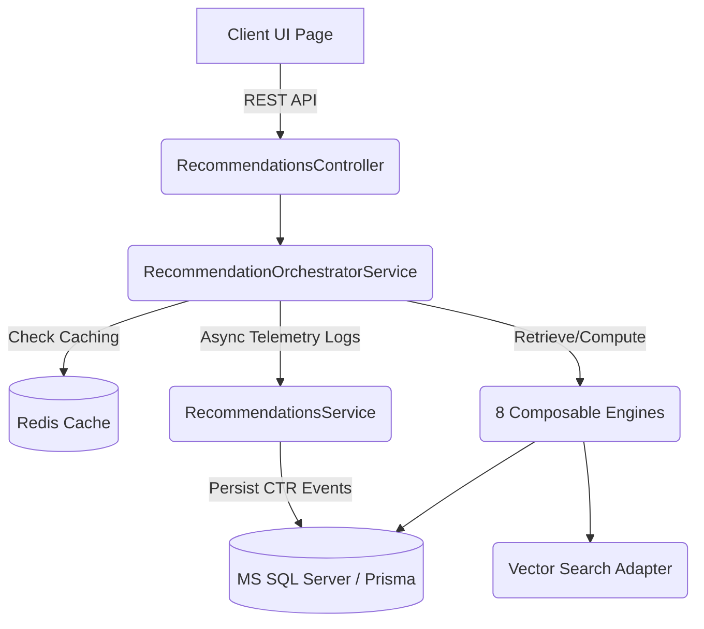

# APEX LUXE AI Recommendation Engine Architecture

This document details the production-grade, AI-driven activewear recommendation system implemented in Phase B.3 of the APEX LUXE enterprise platform. The system combines user interaction behavior, style profile intelligence, catalog metadata, and vector database readiness to deliver highly personalized shopping experiences.

---

## 1. Architectural Overview

The AI Recommendation Engine is designed as a composable, modular service layer that decouples data retrieval, caching, telemetry, and recommendation logic.



### Key Highlights
- **Centralized Prompt Registry:** Prompt generation is delegated to `prompt-builders/recommendation-prompts.ts` to ensure consistency and prevent scattered template strings.
- **Future Vector Database Readiness:** Embeddings and similarity searches are encapsulated behind a clean interface (`RecommendationEmbeddingAdapter`), supporting simple plug-and-play migration to pgvector, Pinecone, or Milvus.
- **Hierarchical Performance Caching:** Redis caching is applied to all recommendation queries, with tailored TTLs for trending snapshot engines (2 hours) compared to frequently bought together bundles (4 hours).

---

## 2. Database Models (`schema.prisma`)

We introduced 5 core relational models to capture user telemetry, compatibility heuristics, and AI style intelligence:

```prisma
model UserStyleProfile {
  id                  String   @id @default(uuid())
  userId              String   @unique
  user                User     @relation(fields: [userId], references: [id], onDelete: Cascade)
  dominantAesthetic   String   // e.g., "Minimalist Compression", "Volt Brutalism"
  preferredColors     String   // Comma-separated list of colors
  preferredCategories String   // Comma-separated list of categories
  styleEvolution      String   @db.NVarChar(Max) // AI-generated text summary
  confidenceScore     Int      @default(50)
  updatedAt           DateTime @updatedAt
}

model ProductCompatibility {
  id              String   @id @default(uuid())
  productAId      String
  productBId      String
  productA        Product  @relation("CompatA", fields: [productAId], references: [id], onDelete: Cascade)
  productB        Product  @relation("CompatB", fields: [productBId], references: [id], onDelete: NoAction)
  compatibility   Int      // Score from 0 to 100
  aiExplanation   String   @db.NVarChar(Max)
  createdAt       DateTime @default(now())

  @@unique([productAId, productBId])
}

model RecommendationEvent {
  id          String   @id @default(uuid())
  productId   String
  product     Product  @relation(fields: [productId], references: [id], onDelete: Cascade)
  engineType  String   // e.g., "related", "complete_look", "personalized", "bought_together"
  eventType   String   // "impression", "click", "cart_add", "purchase"
  userId      String?
  user        User?    @relation(fields: [userId], references: [id], onDelete: SetNull)
  createdAt   DateTime @default(now())
}

model TrendingSnapshot {
  id          String   @id @default(uuid())
  productId   String   @unique
  product     Product  @relation(fields: [productId], references: [id], onDelete: Cascade)
  score       Float    // Computed trending velocity score
  updatedAt   DateTime @updatedAt
}

model RecommendationFeedback {
  id           String   @id @default(uuid())
  productId    String
  product      Product  @relation(fields: [productId], references: [id], onDelete: Cascade)
  userId       String
  user         User     @relation(fields: [userId], references: [id], onDelete: Cascade)
  feedbackType String   // "like" or "dislike"
  createdAt    DateTime @default(now())

  @@unique([productId, userId])
}
```

---

## 3. Composable Recommendation Engines

We implemented **8 core specialized engines** under `backend/src/modules/recommendations/engines/`:

1. **Related Products Engine (`related-products.engine.ts`):** 
   Matches items in the same category or with identical style aesthetics, supplemented with semantic searches from the vector database adapter.
2. **Complete the Look Engine (`complete-the-look.engine.ts`):** 
   Uses Groq AI to analyze matching items and create a styled activewear outfit.
3. **Frequently Bought Together Engine (`frequently-bought-together.engine.ts`):** 
   Analyzes shopping history and item relationships to propose checkout bundles.
4. **Trending Products Engine (`trending-products.engine.ts`):** 
   Scores trending items based on sales velocity and telemetry.
5. **Personalized Recommendations Engine (`personalized-recommendations.engine.ts`):** 
   Combines style affinity, past purchases, and user style profiles to display a tailored collection feed.
6. **Style Affinity Engine (`style-affinity.engine.ts`):** 
   Compiles and dynamically updates the `UserStyleProfile` based on interactions.
7. **Smart Cross-Sell Engine (`smart-cross-sell.engine.ts`):** 
   Suggests complementary items like accessories, bags, or shoes during cart actions.
8. **Outfit Compatibility Engine (`outfit-compatibility.engine.ts`):** 
   Scores compatibility between two items using design attributes.

---

## 4. Frontend Integration Pages

The recommendations suite is fully integrated across all major client routes, mapped using `mapBackendProductToFrontend` to guarantee type-safety and visual consistency:

| Page Route | Integrated Widgets | Component Function |
| :--- | :--- | :--- |
| **Homepage (`/`)** | `PersonalizedRecommendations`<br>`TrendingProductsCarousel` | Custom personalization feed for active users, combined with live trending items. |
| **Product Details (`/product/[id]`)** | `FrequentlyBoughtTogether`<br>`CompleteTheLookCarousel`<br>`RelatedProductsCarousel` | Multi-product bundle selections, stylistic outfit matching, and semantic related items. |
| **Cart (`/cart`)** | `CartCrossSells` | Recommends accessories and gears matching items in the shopping cart. |
| **Checkout (`/checkout`)** | `CartCrossSells` | Last-minute impulse buys for gears at the bottom of the checkout flow. |
| **Profile (`/profile`)** | `StyleDNACard` | Displays the user's AI-computed activewear Style DNA card. |

---

## 5. Verification & Telemetry Logs

Every recommendation impression, click, and shopping cart addition generates an event registered in the database, allowing admin insights into Recommendation CTR (Click-Through Rate):

- **Event Logging API:** `POST /recommendations/event` logs impressions and clicks asynchronously.
- **Feedback Logging API:** `POST /recommendations/feedback` registers like/dislike signals.
- **Admin Dashboard API:** `GET /recommendations/admin/analytics` retrieves conversion stats.
