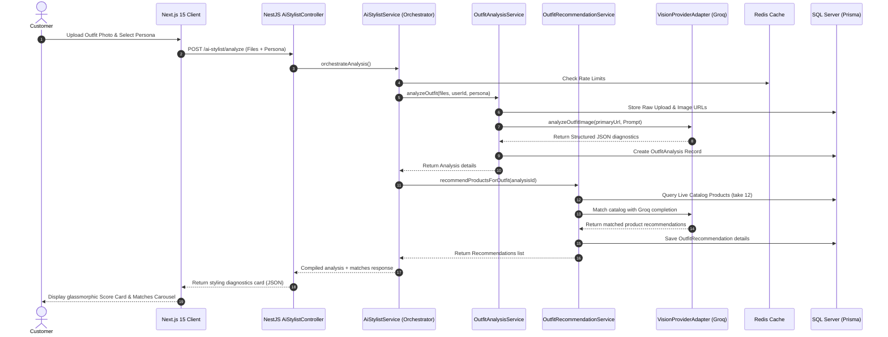

# APEX LUXE AI Stylist 2.0 — Architecture Design

This document details the architectural patterns, data flow pipelines, prompting strategies, caching mechanisms, and security model of the **AI Stylist 2.0** subsystem integrated into the APEX LUXE commerce environment.

---

## 1. System Overview & Core Workflow

The AI Stylist 2.0 platform is a production-grade, modular fashion intelligence system. It evaluates user-uploaded apparel, assigns weighted coordinate scores, checks color and silhouette harmony, and matches the outfit with real products in the live database catalog.



---

## 2. Abstraction Layer: VisionProviderAdapter

To ensure our AI pipeline remains **multimodal-ready** and easily extensible as vision models evolve, we decoupled the visual intelligence provider from our services.

### Decoupled Interface Contract
All vision requests route through the `VisionProviderAdapter` interface:

```typescript
export interface VisionAnalysisResult {
  overallScore: number;
  styleCategory: string;
  outfitSummary: string;
  strengths: string[];
  weaknesses: string[];
  detectedColors: string[];
  fitAnalysis: string;
  confidenceScore: number;
  aestheticType: string;
  sportwearCompatibility: string;
  layeringAnalysis: string;
  recommendedImprovements: string[];
}

export interface VisionProviderAdapter {
  analyzeOutfitImage(imageUrl: string, prompt: string): Promise<VisionAnalysisResult>;
}
```

### Groq Vision Implementation
The system implements `GroqVisionAdapter` targeting the `llama-3.2-11b-vision-preview` model, which uses OpenAI-compatible vision messages structure. It includes a fallback logic that triggers high-quality simulated sportswear insights if the API is offline or unconfigured.

### Future Provider Adaptability
To swap providers (e.g. to OpenAI, Gemini, or Claude), developers only need to create a new adapter implementing the interface and register it in `ai-stylist.module.ts`:

- **OpenAI Vision**: Adapt using `@google/genai` or `openai` SDK targeting `gpt-4o`.
- **Gemini Vision**: Adapt using `@google/genai` targeting `gemini-2.5-flash`.
- **Claude Vision**: Adapt using `@anthropic-ai/sdk` targeting `claude-3-5-sonnet`.

---

## 3. Centralized Prompt Registry System

To keep prompts clean, maintainable, and decoupled from component logic, we established a centralized `PromptRegistry` class. This class compiles prompts dynamically based on selected style personas.

### Supported Style Personas
1. **Performance Athlete**: Focuses on body-mapping, aerodynamic profiles, compression zone benefits, and thermoregulation.
2. **Minimalist Athlete**: Prioritizes monochrome styling (black, slate, cream, carbon), hidden seams, and matte texturing.
3. **Streetwear Hybrid**: Balances base layer compression fits with oversized transitional outerwear shapes.
4. **Luxury Gymwear**: Emphasizes high-thread-count fleeces, tactile weight, and rich tone coordinates.
5. **Functional Runner**: Directs focus toward wind/drizzle protection, lightweight footwear, and reflectivity.
6. **Oversized Urban**: Focuses on slouchy silhouettes, dropped shoulders, and urban sneaker coordinates.

---

## 4. Caching & Performance Optimization

To protect downstream LLM APIs and minimize latency, we implemented a dual Redis caching strategy:

### A. Output Caching
- **Complete Outfit Generation**: Generated coordinate combinations for goals (e.g., monochrome fit, summer run fit) are cached for 1 hour under `stylist:generation:${outfitType}:${persona}`.
- **Cache Eviction**: Catalog changes or product archive requests trigger a pattern deletion `stylist:generation:*` using `RedisService.delByPattern` to prevent stale recommendations.

### B. Rate-Limiting & Cooldowns
To prevent brute-force request spam:
- **Outfit Analysis Route**: Authenticated users have a 15-second cooldown under `ratelimit:stylist:analysis:${userId}`.
- **Stylist Chat Route**: Messages have a 3-second cooldown under `ratelimit:stylist:chat:${userId}`.

---

## 5. Database Schema & Relations

We registered five models inside the Microsoft SQL Server database via Prisma. Cascade paths are configured to prevent SQL Server's cyclic cascade errors:

```prisma
model OutfitAnalysis {
  id                      String                 @id @default(uuid())
  userId                  String?
  user                    User?                  @relation(fields: [userId], references: [id], onDelete: Cascade)
  imageUrl                String                 @db.NVarChar(Max)
  overallScore            Int
  styleCategory           String
  outfitSummary           String                 @db.NVarChar(Max)
  strengths               String                 @db.NVarChar(Max)
  weaknesses              String                 @db.NVarChar(Max)
  detectedColors          String                 @db.NVarChar(Max)
  fitAnalysis             String                 @db.NVarChar(Max)
  confidenceScore         Int
  aestheticType           String
  sportwearCompatibility  String                 @db.NVarChar(Max)
  layeringAnalysis        String                 @db.NVarChar(Max)
  recommendedImprovements String                 @db.NVarChar(Max)
  createdAt               DateTime               @default(now())
  recommendations         OutfitRecommendation[]
  savedOutfits            SavedOutfit[]
  chatSessions            OutfitChatSession[]
}

model OutfitRecommendation {
  id             String         @id @default(uuid())
  analysisId     String
  analysis       OutfitAnalysis @relation(fields: [analysisId], references: [id], onDelete: Cascade)
  productId      String
  product        Product        @relation(fields: [productId], references: [id], onDelete: Cascade)
  reason         String         @db.NVarChar(Max)
  matchScore     Int
  createdAt      DateTime       @default(now())
}

model SavedOutfit {
  id         String         @id @default(uuid())
  userId     String
  user       User           @relation(fields: [userId], references: [id], onDelete: Cascade)
  analysisId String
  analysis   OutfitAnalysis @relation(fields: [analysisId], references: [id], onDelete: NoAction, onUpdate: NoAction)
  name       String?
  createdAt  DateTime       @default(now())
}

model OutfitChatSession {
  id         String              @id @default(uuid())
  userId     String?
  user       User?               @relation(fields: [userId], references: [id], onDelete: NoAction, onUpdate: NoAction)
  analysisId String?
  analysis   OutfitAnalysis?     @relation(fields: [analysisId], references: [id], onDelete: NoAction, onUpdate: NoAction)
  createdAt  DateTime            @default(now())
  messages   OutfitChatMessage[]
}

model OutfitChatMessage {
  id        String            @id @default(uuid())
  sessionId String
  session   OutfitChatSession @relation(fields: [sessionId], references: [id], onDelete: Cascade)
  role      String
  content   String            @db.NVarChar(Max)
  createdAt DateTime          @default(now())
}
```

---

## 6. Security & Input Verification

1. **Payload Size Restrictions**: File size is validated in NestJS controllers to be under 5MB per upload.
2. **MIME-Type Whitelisting**: Express Multer limits file extensions strictly to `image/png`, `image/jpeg`, `image/jpg`, and `image/webp`.
3. **Prompt Injection Defense**: Inputs sent to Groq completions (e.g. Chat queries, persona keys) are parameterized, run through character limits, and system roles are strongly declared as system boundaries.
4. **Referential Cycles Safeguard**: Avoids foreign-key cascade cycles on SQL Server by employing `onDelete: NoAction` for overlapping user-associated tables.
