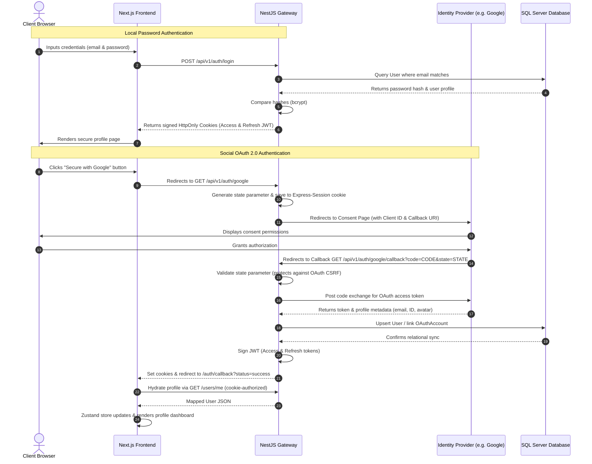

# Authentication Architecture

This document outlines the design, security protocols, token management, and integration patterns of the unified identity management system of the APEX LUXE platform.

> [!NOTE]
> Facebook OAuth and Twitter/X OAuth are **temporarily disabled** in this version of the APEX LUXE platform. Google, Microsoft, and GitHub OAuth are active and fully supported.

---

## 1. Unified Authentication Protocol Flow

APEX LUXE merges standard local credentials (email/password) with social OpenID Connect (OIDC) / OAuth 2.0 protocols into a single, cohesive security gateway.

### Architectural Sequence Diagram

---

## 2. Token Management & Rotation

### A. JWT Configuration
- **Access Tokens:** Signed with `JWT_SECRET`. Lifetime: `900s` (15 minutes). Holds user `id`, `email`, and `role` claims.
- **Refresh Tokens:** Signed with `JWT_REFRESH_SECRET`. Lifetime: `7d` (7 days). Linked to the user profile in the database.

### B. Silent Token Rotation (Refresh Loop)
Cookies are secured with the following flags:
- `HttpOnly`: Prevents access via client-side JavaScript (`document.cookie`), mitigating XSS vulnerabilities.
- `Secure`: Transmitted only over encrypted SSL/TLS channels (automatically toggled based on environment).
- `SameSite=Strict`: Prevents cookies from being transmitted on cross-site requests, mitigating CSRF.
- `__Host-` Cookie Prefix: Enforces origin constraints in production.

When the Next.js `apiClient` receives a `401 Unauthorized` response due to an expired access token, it automatically triggers a post request to `/api/v1/auth/refresh`. The NestJS backend rotates the refresh token (revokes the old one, issues a new one) and sets a fresh access token cookie, all without disrupting the user's interactive session.

---

## 3. Account Linking Resolution

To prevent profile duplication while maintaining strict security, accounts are mapped as follows:

1. **Unique Email Anchor:** The system uses the verified email as the master anchor for identity.
2. **Provider Mapping:** The `OAuthAccount` table maintains a compound unique key on `[provider, providerAccountId]`.
3. **Linking Logic:**
   - If a user attempts to log in via Google with the email `user@example.com`, and that email already exists in the `User` table (having originally registered via email/password), the backend verifies the provider callback payload and automatically records a new `OAuthAccount` entry linked to that existing `User` record.
   - The user can then authenticate using either their password or Google.

---

## 4. Key Security Controls

| Threat | Security Mitigation Mechanism |
|---|---|
| **Brute Force & Scraping** | Global `ThrottlerModule` rate limits authentication actions (`auth` group restricted to 5 attempts/minute). |
| **OAuth CSRF Hijacking** | Passport OAuth `state: true` parameter verification supported by transient session cookies. |
| **Password Breaches** | Cryptographic key stretching via `bcrypt` (10 rounds). Nullable passwords for OAuth-only users to eliminate default password vulnerabilities. |
| **XSS Token Theft** | Fully stateless JWT architecture where tokens are locked behind HttpOnly boundaries. |
