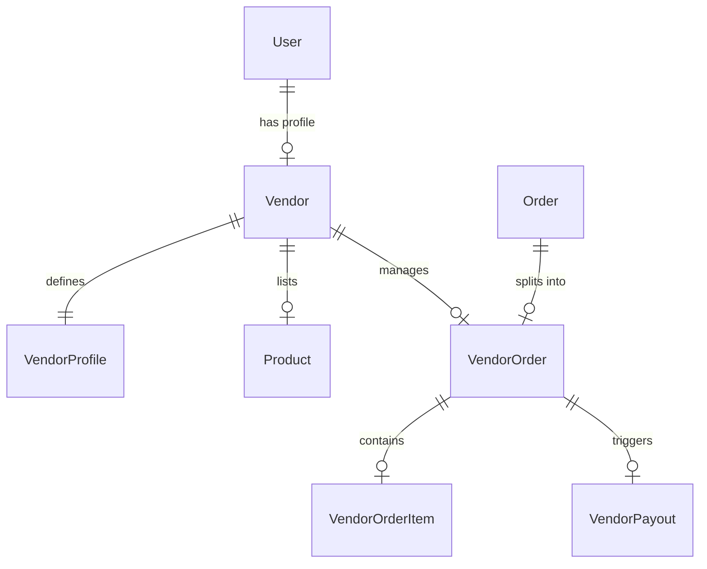

# APEX LUXE — Phase D: Marketplace & Advanced AI Commerce Platform

This document outlines the technical architecture, database models, Stripe Connect integration flows, commission engine, and AI operational intelligence systems implemented in Phase D of the APEX LUXE enterprise platform.

---

## 1. Database & Security Architecture

### Schema Models (`schema.prisma`)
The database schema has been designed to support multi-vendor isolation while maintaining referential integrity in a SQL Server environment. Relationships use `onDelete: NoAction` and `onUpdate: NoAction` to prevent referential cascade cycles.

* **`Vendor`**: Stores the seller's registration, Stripe Connect Account ID (`stripeAccountId`), verification status, and default commission rates.
* **`VendorProfile`**: Extends the vendor with public store metadata, support contact channels, brand logo, and banner assets.
* **`VendorOrder` & `VendorOrderItem`**: Captures checkout cart item allocations corresponding to individual vendors. Each master purchase order splits into sub-orders for clear dashboard isolation.
* **`VendorPayout`**: Ledger logs capturing transfer payments, statuses (`paid`, `pending`, `failed`), and Stripe transfer reference IDs.
* **`VendorAnalytics`**: Stores aggregated historical records for vendor performance tracking.



---

## 2. Stripe Connect Onboarding & Verification

APEX LUXE leverages **Stripe Connect Express** for automated multi-vendor onboarding and verification:

1. **Vendor Registration**:
   - A user registers a store name via `POST /vendor/register`.
   - A Stripe Connected account is created on-the-fly (`type: 'express'`).
   - The user's account ID (`stripeAccountId`) is stored in the database.
2. **Onboarding Link Generation**:
   - The vendor is directed to `POST /vendor/onboard` with a return/refresh URL structure.
   - The backend requests an onboarding link from Stripe (`stripe.accountLinks.create`).
3. **Verification Checks**:
   - When the vendor completes the Stripe form and is redirected back, `GET /vendor/status` retrieves the active account details from Stripe.
   - If `details_submitted` and `charges_enabled` are true, the vendor status is updated to `verified` in the database, activating their listings.

---

## 3. Split Checkout Payouts & Commission Engine

During order placement (in `OrdersService.markOrderAsPaid`), the transaction commits the master order and asynchronously triggers split transfers to the respective vendors:

```
  Customer Checkout Payment (APEX Platform Account)
                       │
                       ▼
             Commission Calculation
       (e.g., 15% Base, 12% Footwear, etc.)
                       │
        ┌──────────────┴──────────────┐
        ▼                             ▼
   Platform Share               Vendor Net Share
 (APEX Account Balance)     (Stripe Connect Transfer)
                                      │
                                      ▼
                             Vendor Bank Account
```

### Dynamic Commission Fees
The commission engine calculates splits per line-item:
* **Base Rate**: 15% standard.
* **Footwear Category**: Override to 12% to incentivize high-ticket athletic shoes.
* **Accessories Category**: Override to 10%.
* **Promotional Discount Code Fee**: Adds 2% platform fee if the customer checkout transaction utilized a promotional code.

### Resilient Queue Ledger
If the transfer attempt to Stripe fails (due to connection latency, rate limits, or incomplete onboarding details), the payout status is saved as `pending` or `failed` in the `VendorPayout` table. Once the vendor completes Stripe onboarding or the issue is resolved, the system triggers `retryPendingPayouts` to automatically retry all backlogged payouts.

---

## 4. AI Operational Intelligence & Pricing Advice

The vendor dashboard is enhanced with Groq-powered AI insights (`MarketplaceAiService`) leveraging the Llama3 model:

* **Market Insights**: Analyzes inventory quantities, transaction volumes, low stock thresholds, and current pricing.
* **Dynamic Pricing Guidance**: Suggests modifications based on markdown values or category performances.
* **Resilient Fallbacks**: If the Groq API becomes unavailable, a rule-based logic fallback acts as a safety guard to generate analytics:
  - Highlights exact items falling below low-stock caps.
  - Recommends 10% competitive price trims for slow-moving categories.
  - Suggests bundle deals for accessories.

---

## 5. Frontend Vendor Panel & Dashboard

The frontend features a dedicated, dark/cyberpunk layout for vendor workspaces, completely separating them from standard consumer headers and footers:

* **Onboarding Screen**: Blocks access to the catalog/payouts until Stripe Connect is completed.
* **Revenue Metrics**: High-performance dashboard displaying Gross Revenue, Net Earnings, Commission Paid, and active orders.
* **Catalog CRUD (`/vendor/products`)**: Dynamic interfaces to add/edit products, manage colors/sizes, and control low-stock warning margins.
* **Order Logistics (`/vendor/orders`)**: Slide-out details of sub-orders, customer addresses, shipping items checklist, and carrier tracking submission drawers.
* **Payouts Ledger (`/vendor/payouts`)**: A clean tabular audit ledger showing all Stripe payout logs, transfer statuses, and Connected account compliance steps.
* **Settings Profile (`/vendor/settings`)**: Updates store contact numbers, support email address, website URLs, and visual branding logos.
