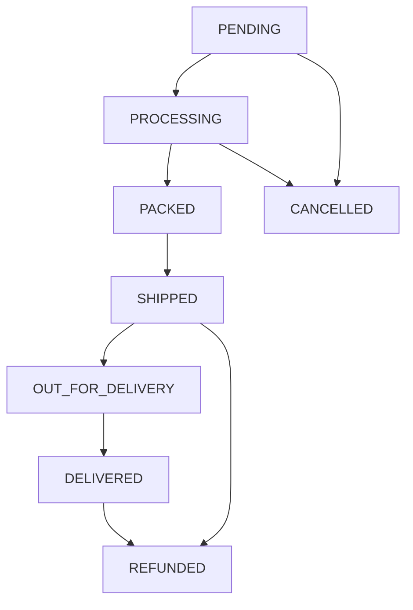

# APEX LUXE Order Lifecycle & Tracking

This document details the order status transition states, database tracking events timeline, carrier updates, and transaction refund logic.

---

## 1. Order Status Transition Matrix

Each purchase order moves through structured logistical phases:

- **`pending`**: Checkout created, waiting for Stripe payment validation. Stock is temporarily reserved in the database.
- **`processing`**: Payment succeeded. Stock reservation committed, item prepared for packaging at Zurich Headquarters.
- **`packed`**: Order wrapped, boxed, and awaiting courier pickup.
- **`shipped`**: Carrier details and tracking identifier assigned.
- **`out_for_delivery`**: Carrier vehicle departs for final delivery.
- **`delivered`**: Package signed for by customer. Terminal success state.
- **`cancelled`**: Session terminated before completion or cancelled manually. Stock is released back into the catalog.
- **`refunded`**: Paid amount returned via Stripe, items returned back to active stock.

---

## 2. Order Event Timeline Tracking

Every status transition is logged in the `OrderEvent` model:
- `status`: Transitioned status value.
- `notes`: Descriptive reason or notes detailing the state change.
- `createdAt`: Date stamp of transition.

This historical data is loaded dynamically on the `/tracking/[id]` screen to render a progress timeline with absolute precision.

---

## 3. Shipping & Carrier Tracking Updates

Fulfillment support agents register tracking numbers directly:
- **Parameters**: `trackingNumber` (e.g., `TRK-98218-AZ`), `carrier` (e.g., `FedEx`, `DHL`).
- **Effect**: Automatically transitions status to `shipped` and logs a new `OrderEvent` timeline record.

---

## 4. Refund Operations

Support agents can initiate partial or full refunds:
1. Calls the **Stripe Refund API** natively using the stored `paymentIntentId`.
2. Re-credits the returned items back into the active catalog stock (`stockQuantity` incremented, status re-evaluated).
3. Transition status to `refunded` and records a detailed `Refund` event.
