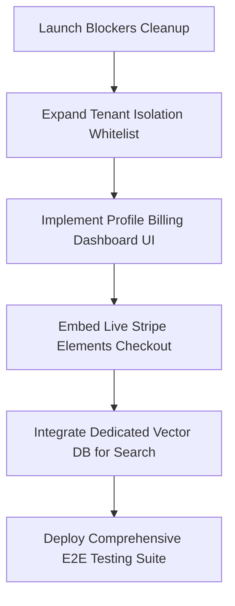

# AUDIT SUMMARY: APEX LUXE

This audit report compares the documentation claims with the actual state of the codebase. It highlights code mismatches, architectural limitations, technical debt, launch blockers, and presents the post-Phase L engineering roadmap.

---

## 1. Documentation Claims vs. Code Reality

| Dimension | Documentation Claim | Actual Code State |
| :--- | :--- | :--- |
| **Project Scope** | Standard MVP D2C e-commerce platform with single-currency payments and basic vendor options. | **Fully Global Commerce SaaS Hybrid**. The platform actually contains advanced multi-tenant store building, multi-warehouse stock allocations, multi-currency conversions, and deep AI-driven forecasting. |
| **Loyalty & Retention** | Planned or missing. | **Fully Implemented**. Loyalty account tiers ([Bronze, Silver, Gold, Platinum](file:///f:/CV/E-Commerce%20Platform/backend/src/modules/loyalty/loyalty.service.ts)), points ledger, rewards redemption coupons, referral programs (signup + purchase awards), and BullMQ cart recovery are complete. |
| **Multi-Tenant SaaS** | Basic vendor-to-product mapping relationships. | **Highly Advanced SaaS Builder**. Full subdomain extraction, custom CNAME lookup ([DomainService](file:///f:/CV/E-Commerce%20Platform/backend/src/modules/saas/domain.service.ts)), Stripe tenant plans (Starter, Growth, Pro, Enterprise) checking product and warehouse limits, and custom CSS engines. |
| **AI Experience** | Basic stylist mock chatbots. | **14 Distinct AI Services**. Active styling vision pipelines ([OutfitAnalysisService](file:///f:/CV/E-Commerce%20Platform/backend/src/modules/ai-stylist/outfit-analysis.service.ts)), dynamic pricing, demand forecasting, VIP segmentation, campaign copy generation, and telemetry logs. |
| **Omnichannel & PWA** | Mobile responsiveness tags. | **Progressive Web App Active**. Features `@ducanh2912/next-pwa` service workers, offline fallback views ([offline.html](file:///f:/CV/E-Commerce%20Platform/frontend/public/offline.html)), QR code builders, and omnichannel dispatchers (email + push + in-app). |

---

## 2. Missing Features

1. **Consumer Profile Billing UI Widgets**:
   * *Description*: The backend implements setup intents, listing saved cards (`/payments/payment-methods/sync`), detaching cards, and subscription checkouts/cancellations. However, the customer profile page ([profile/page.tsx](file:///f:/CV/E-Commerce%20Platform/frontend/src/app/profile/page.tsx)) does not contain tabs or forms for users to view/manage subscriptions or detach saved payment methods.
2. **Live Stripe Elements Integration on Checkout**:
   * *Description*: The customer checkout page ([checkout/page.tsx](file:///f:/CV/E-Commerce%20Platform/frontend/src/app/checkout/page.tsx)) utilizes a webhook simulator (`/payments/webhook`) rather than mounting the live Stripe Elements provider to collect credit card fields directly.

---

## 3. Mismatches & Implementation Gaps

1. **Multi-Tenant Isolation Scoping Constraints**:
   * *Detail*: The [PrismaService](file:///f:/CV/E-Commerce%20Platform/backend/src/modules/prisma/prisma.service.ts) interceptor automatically appends `tenantId` queries for a whitelist of 12 tables. Unlisted tables (such as `Review`, `CartItem`, `AuditLog`, `OutfitAnalysis`, `SavedOutfit`, and `OutfitChatSession`) do not filter by `tenantId` automatically. They are isolated *indirectly* by joining on whitelisted models, introducing potential data leakage risks if direct custom queries are executed.
2. **Mock Integration / Dry-Run Modes**:
   * *Detail*: Integrations for Firebase Cloud Messaging, Stripe transactions, and Groq API calls degrade to local rule-based mock simulations if credentials are absent. This allows developer velocity but means production validation is pending live setup.

---

## 4. Technical Debt

* **Monolithic Page Files**: Views like [profile/page.tsx](file:///f:/CV/E-Commerce%20Platform/frontend/src/app/profile/page.tsx) and admin dashboards are dense and combine layout, state syncing, and business logic.
* **Vector Semantic Search Simulation**: Search queries are executed using simulated database lookups rather than connecting to a dedicated Vector DB database (like pgvector or Pinecone).
* **End-to-End Test Suite Gaps**: Core testing includes Jest unit scaffolds, but full browser-level E2E tests validating multi-tenant billing isolation and webhook queues are missing.

---

## 5. Launch Blockers

1. **Stripe Production Credentials**:
   * Live keys must replace `STRIPE_SECRET_KEY` in [.env](file:///f:/CV/E-Commerce%20Platform/backend/.env) to process live merchant payments.
2. **Firebase Service Account Configuration**:
   * Valid `FIREBASE_SERVICE_ACCOUNT_JSON` is required in the backend environment to route actual push notifications to consumer PWAs.
3. **DNS Mapping Configuration**:
   * The SaaS platform requires wildcards CNAME setup (e.g., `*.apexluxe.com`) on the hosting provider to process tenant subdomain redirects.

---

## 6. Recommended Post-Phase L Roadmap

### Milestone 1: Tenant Security Hardening (Immediate)
* Expand the `modelsWithTenantId` whitelist in [PrismaService](file:///f:/CV/E-Commerce%20Platform/backend/src/modules/prisma/prisma.service.ts) to cover all customer review and stylist sessions data.
* Restrict super-admin platform endpoints to block cross-tenant updates.

### Milestone 2: Customer Checkout & Billing Integration
* Refactor [profile/page.tsx](file:///f:/CV/E-Commerce%20Platform/frontend/src/app/profile/page.tsx) to build saved card listing tabs and active subscription cancel options.
* Replace checkout simulation with live Stripe Hosted Checkout redirecting or embedded Stripe Elements fields.

### Milestone 3: Search Scaling & E2E Validation
* Replace semantic search mocks with a vector-store index (e.g., Pinecone or PostgreSQL pgvector).
* Build Playwright scripts simulating tenant onboarding, subscription payment, catalog upload, and client checkout across subdomains.
