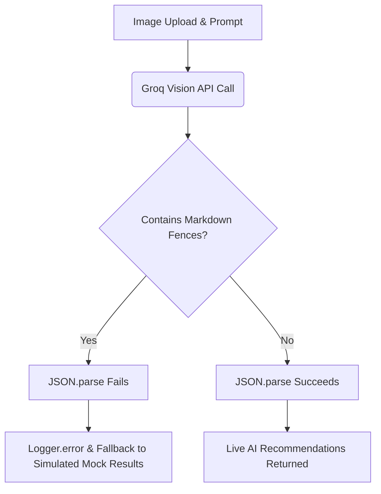

# APEX LUXE — STABILIZATION AUDIT

This stabilization audit identifies critical routing conflicts, parsing exceptions, translation gaps, theme rendering bugs, and environment inconsistencies in the **APEX LUXE** codebase. Each issue is analyzed with its root cause, affected files with line references, severity, required fixes, and estimated implementation effort.

---

## Executive Summary Matrix

| ID | Domain | Severity | Affected Area | Est. Effort | Impact |
| :--- | :--- | :--- | :--- | :--- | :--- |
| **1** | **AI Stylist Execution Path** | ⚠️ **Medium** | Backend AI Modules | 0.5 Hours | Fails on markdown fenced JSON outputs, triggering simulated mock fallbacks. |
| **2** | **Mail System (Resend vs SMTP)** | 🚨 **High** | Backend Mail Service | 1.0 Hours | Hardcoded localhost URLs break user onboarding, activation, and checkout in production. |
| **3** | **Translation Coverage** | ⚠️ **Medium** | Frontend Pages & Admin | 4.0 Hours | Hardcoded English copy breaks UI experience when Arabic is selected. |
| **4** | **Currency Conversion Coverage** | 🚨 **High** | Frontend Catalog Pages | 2.0 Hours | Hardcoded USD formatting renders currency selection ineffective on store listings. |
| **5** | **Theme System Coverage** | 🚨 **High** | Frontend Components & Pages | 3.0 Hours | Hardcoded Tailwind dark classes make text unreadable (white-on-white) in light mode. |
| **6** | **Firebase Push Integration** | 🚨 **High** | Frontend Public Assets | 1.0 Hours | Missing root service worker disables PWA background push notifications. |
| **7** | **Google OAuth Flow** | 🚨 **High** | Backend Auth & Strategies | 1.5 Hours | `SameSite: strict` cookies fail cross-origin redirection; callback URLs default to localhost. |
| **8** | **Hydration Errors** | 🚨 **High** | Frontend Render Engine | 2.0 Hours | Mismatch between English SSR and client-side Arabic state causing console flood & layout flashes. |
| **9** | **SaaS vs. Store Routing** | 🚨 **High** | Frontend Middleware & Dashboard | 3.0 Hours | Prefix clash under `/admin` blocks tenant admins (with global `customer` role) from store management. |

---

## Detailed Findings & Action Plan

### 1. AI Stylist Execution Path

#### Root Cause
Groq Vision models (`llama-3.2-11b-vision-preview` and `llama-3.3-70b-specdec`) sometimes wrap JSON responses in Markdown code fences (e.g., ` ```json\n...\n``` `), despite setting `response_format: { type: "json_object" }` in the API payload. The current code calls `JSON.parse` directly on the raw string. When code fences are present, this triggers a parsing exception and falls back on simulated mock results.



#### Affected Files
* [groq-vision-adapter.ts](file:///f:/CV/E-Commerce%20Platform/backend/src/modules/ai-stylist/interfaces/groq-vision-adapter.ts#L69-L70) (Lines 69-70)
* [outfit-recommendation.service.ts](file:///f:/CV/E-Commerce%20Platform/backend/src/modules/ai-stylist/outfit-recommendation.service.ts#L87) (Line 87)
* [outfit-recommendation.service.ts](file:///f:/CV/E-Commerce%20Platform/backend/src/modules/ai-stylist/outfit-recommendation.service.ts#L182) (Line 182)

#### Severity
* ⚠️ **Medium** (breaks live Vision/LLM completions and returns mock data)

#### Required Fixes
Introduce a JSON extraction utility to sanitize string payloads before calling `JSON.parse`.
```typescript
export function cleanJsonString(raw: string): string {
  if (!raw) return '';
  return raw
    .replace(/^```json\s*/i, '') // Remove starting fence
    .replace(/```\s*$/, '')      // Remove ending fence
    .trim();
}
```
Apply this helper function prior to all `JSON.parse` instances in the affected files.

#### Estimated Effort
* **0.5 hours**

---

### 2. Mail System (Resend vs. SMTP)

#### Root Cause
1. **SMTP Exclusivity**: The mail system is configured exclusively for SMTP via `nodemailer`. The Resend provider mentioned in design documents is completely absent; no `resend` dependencies are declared in `package.json`.
2. **Hardcoded Host Domains**: Verification, restock, pricing drops, and order tracking emails hardcode `http://localhost:3000` URLs instead of drawing from environment variables.

#### Affected Files
* [mail.service.ts](file:///f:/CV/E-Commerce%20Platform/backend/src/modules/mail/mail.service.ts#L91) (Lines 91, 109, 142, 179, 207, 232, 264, 293, 325, 346)
* [package.json](file:///f:/CV/E-Commerce%20Platform/backend/package.json) (absence of `resend` dependency)

#### Severity
* 🚨 **High** (completely breaks user redirection for account verification, password recovery, and email notifications in staging/production environments)

#### Required Fixes
* Inject the frontend application domain using NestJS `ConfigService` in [mail.service.ts](file:///f:/CV/E-Commerce%20Platform/backend/src/modules/mail/mail.service.ts):
  ```typescript
  const frontendUrl = this.configService.get<string>('FRONTEND_URL') || 'http://localhost:3000';
  ```
* Replace all hardcoded `http://localhost:3000` strings with the dynamic `frontendUrl` variable.

#### Estimated Effort
* **1.0 hours**

---

### 3. Translation Coverage

#### Root Cause
While translation dictionary assets (`messages/en.json` and `messages/ar.json`) exist, primary storefront layouts and administrative views completely omit imports or calls to the `useTranslation` context hook. They render static, hardcoded English copy, resulting in a fractured multilingual experience when switching to Arabic.

#### Affected Files
* **Storefront Pages**:
  * [cart/page.tsx](file:///f:/CV/E-Commerce%20Platform/frontend/src/app/cart/page.tsx)
  * [checkout/page.tsx](file:///f:/CV/E-Commerce%20Platform/frontend/src/app/checkout/page.tsx)
  * [product/[id]/page.tsx](file:///f:/CV/E-Commerce%20Platform/frontend/src/app/product/%5Bid%5D/page.tsx)
  * [shop/page.tsx](file:///f:/CV/E-Commerce%20Platform/frontend/src/app/shop/page.tsx)
  * [wishlist/page.tsx](file:///f:/CV/E-Commerce%20Platform/frontend/src/app/wishlist/page.tsx)
  * [loyalty/page.tsx](file:///f:/CV/E-Commerce%20Platform/frontend/src/app/loyalty/page.tsx)
  * [ai-stylist/page.tsx](file:///f:/CV/E-Commerce%20Platform/frontend/src/app/ai-stylist/page.tsx)
* **Administrative Pages**:
  * All views under [frontend/src/app/admin/*](file:///f:/CV/E-Commerce%20Platform/frontend/src/app/admin)

#### Severity
* ⚠️ **Medium** (breaks structural consistency and visual integrity for global users)

#### Required Fixes
* Import `useTranslation` from [I18nProvider](file:///f:/CV/E-Commerce%20Platform/frontend/src/providers/I18nProvider.tsx) on storefront and admin pages.
* Extract all user-facing static labels and place them in `messages/en.json` and `messages/ar.json`.
* Replace hardcoded copy with `t('namespace.key')` hooks.

#### Estimated Effort
* **4.0 hours**

---

### 4. Currency Conversion Coverage

#### Root Cause
The `CurrencyProvider.tsx` contains rate logic and formatting structures (`usdToActive`, `formatPrice`). However, these utilities are only called inside the Navbar switcher and the checkout page. The remainder of the storefront catalog pages render price labels statically (e.g. `${product.price.toFixed(2)}`), rendering the currency switcher non-functional on active shopping pages.

#### Affected Files
* [shop/page.tsx](file:///f:/CV/E-Commerce%20Platform/frontend/src/app/shop/page.tsx#L445) (Line 445)
* [product/[id]/page.tsx](file:///f:/CV/E-Commerce%20Platform/frontend/src/app/product/%5Bid%5D/page.tsx#L176) (Line 176)
* [cart/page.tsx](file:///f:/CV/E-Commerce%20Platform/frontend/src/app/cart/page.tsx#L102) (Lines 102, 157, 162, 171, 210, 291)
* [wishlist/page.tsx](file:///f:/CV/E-Commerce%20Platform/frontend/src/app/wishlist/page.tsx)
* [collections/new-arrivals/page.tsx](file:///f:/CV/E-Commerce%20Platform/frontend/src/app/collections/new-arrivals/page.tsx)
* [collections/performance/page.tsx](file:///f:/CV/E-Commerce%20Platform/frontend/src/app/collections/performance/page.tsx)

#### Severity
* 🚨 **High** (defeats multi-currency global readiness by lock-in displaying USD format across all products)

#### Required Fixes
* Import `useCurrency` inside storefront pages:
  ```typescript
  import { useCurrency } from '../../providers/CurrencyProvider';
  const { formatPrice, usdToActive } = useCurrency();
  ```
* Format price values dynamically using `formatPrice(usdToActive(product.price))`.

#### Estimated Effort
* **2.0 hours**

---

### 5. Theme System Coverage

#### Root Cause
Although `ThemeProvider.tsx` toggles `light` and `dark` classes on the root `documentElement`, key storefront layouts hardcode color utilities (`text-white`, `bg-black`, `border-white/5`) instead of utilizing theme-aware variables (`text-foreground`, `bg-background`, `border-outline-variant`). When a user switches to light mode, backgrounds turn white but text remains white, creating unreadable, low-contrast views.

#### Affected Files
* [ai-stylist/page.tsx](file:///f:/CV/E-Commerce%20Platform/frontend/src/app/ai-stylist/page.tsx)
* [shop/page.tsx](file:///f:/CV/E-Commerce%20Platform/frontend/src/app/shop/page.tsx)
* [Navbar.tsx](file:///f:/CV/E-Commerce%20Platform/frontend/src/components/Navbar.tsx)
* [Footer.tsx](file:///f:/CV/E-Commerce%20Platform/frontend/src/components/Footer.tsx)

#### Severity
* 🚨 **High** (makes the storefront completely unusable when switching to light theme due to severe contrast failures)

#### Required Fixes
* Audit UI layouts and replace hardcoded color variables with CSS theme variables defined in `globals.css` and mapped in `tailwind.config.ts`.
* Replace `bg-black`/`bg-neutral-950` with `bg-background`/`bg-surface`.
* Replace `text-white`/`text-neutral-400` with `text-foreground`/`text-on-surface-variant`.
* Replace `border-white/5` with `border-outline-variant`.

#### Estimated Effort
* **3.0 hours**

---

### 6. Firebase Push Integration

#### Root Cause
PWA background notifications depend on a service worker file to run background push hooks when the tab is closed or idle. The Firebase SDK looks for this worker file under the exact path `/firebase-messaging-sw.js` in the public directory. The public folder contains assets like `sw.js` and `manifest.json`, but `firebase-messaging-sw.js` is missing, resulting in 404 console errors and disabling background pushes.

#### Affected Files
* **Missing File**: [firebase-messaging-sw.js](file:///f:/CV/E-Commerce%20Platform/frontend/public/firebase-messaging-sw.js) (Must be created)
* **Configuration Files**:
  * [firebase.ts](file:///f:/CV/E-Commerce%20Platform/frontend/src/lib/firebase.ts)
  * [PushNotificationInit.tsx](file:///f:/CV/E-Commerce%20Platform/frontend/src/components/PushNotificationInit.tsx)
  * [push-notifications.ts](file:///f:/CV/E-Commerce%20Platform/frontend/src/lib/push-notifications.ts)

#### Severity
* 🚨 **High** (completely disables FCM notifications on background status, violating PWA specifications)

#### Required Fixes
* Create `firebase-messaging-sw.js` in the `public` directory.
* Initialize the service worker instance importing the Firebase Compat SDKs:
  ```javascript
  importScripts('https://www.gstatic.com/firebasejs/10.14.0/firebase-app-compat.js');
  importScripts('https://www.gstatic.com/firebasejs/10.14.0/firebase-messaging-compat.js');

  firebase.initializeApp({
    apiKey: "...",
    projectId: "...",
    messagingSenderId: "...",
    appId: "..."
  });

  const messaging = firebase.messaging();
  messaging.onBackgroundMessage((payload) => {
    console.log('[sw] Background notification received:', payload);
  });
  ```

#### Estimated Effort
* **1.0 hours**

---

### 7. Google OAuth Flow

#### Root Cause
1. **Cookie SameSite Blockers**: The access and refresh tokens set on OAuth redirect callback are configured with `sameSite: 'strict'`. In cross-origin dev setups or multi-tenant production subdomains, this prevents the browser from transmitting credentials back on redirect triggers, resulting in 401 Unauthorized errors on client initialization calls (`/users/me`).
2. **Localhost Strategy Callbacks**: Strategy callbacks inside strategy models default to `localhost:5000`, causing authentication setup redirect failures when run on production domains.

#### Affected Files
* [auth.controller.ts](file:///f:/CV/E-Commerce%20Platform/backend/src/modules/auth/auth.controller.ts#L59) (Lines 59-73, 243-257)
* [google.strategy.ts](file:///f:/CV/E-Commerce%20Platform/backend/src/modules/auth/strategies/google.strategy.ts#L18) (Line 18)
* [github.strategy.ts](file:///f:/CV/E-Commerce%20Platform/backend/src/modules/auth/strategies/github.strategy.ts#L18) (Line 18)
* [microsoft.strategy.ts](file:///f:/CV/E-Commerce%20Platform/backend/src/modules/auth/strategies/microsoft.strategy.ts#L18) (Line 18)

#### Severity
* 🚨 **High** (social authentication login attempts loop or crash upon returning to the browser application)

#### Required Fixes
* Change cookie configurations in `AuthController` to use `sameSite: 'lax'` (or `sameSite: 'none'; secure: true` if API and App domains differ entirely).
* Map all social strategy callback URLs strictly to environment configuration settings (e.g. `GOOGLE_CALLBACK_URL`).

#### Estimated Effort
* **1.5 hours**

---

### 8. Hydration Errors

#### Root Cause
1. **Initial Locale Mismatch**: The `I18nProvider` defaults to English (`locale = 'en'`). Under Next.js SSR, pages compile using English strings. On Arabic paths (`/ar/*`), the client changes state to `'ar'` inside `useEffect` on mount, triggering hydration warnings in the browser console.
2. **Missing Suppress Configuration**: The root structure in `layout.tsx` hardcodes `lang="en"` and does not apply `suppressHydrationWarning`, yielding mismatches when the client theme is mounted or the direction attribute changes.

```
Server (SSR)                  Client (Hydration)            Effect Triggered
[lang="en", locale="en"]  --> [lang="en", locale="en"]  --> useEffect runs
                              (Must match Server HTML)       setLocale('ar')
                                                             lang="ar", dir="rtl"
                                                             (Text content updates)
```

#### Affected Files
* [layout.tsx](file:///f:/CV/E-Commerce%20Platform/frontend/src/app/layout.tsx#L106) (Lines 106-110)
* [I18nProvider.tsx](file:///f:/CV/E-Commerce%20Platform/frontend/src/providers/I18nProvider.tsx#L18) (Lines 18-36)

#### Severity
* 🚨 **High** (floods developer tools, invalidates Server Component optimizations, and causes layout flashes on Arabic paths)

#### Required Fixes
* Add `suppressHydrationWarning` to the `<html>` node in `layout.tsx`.
* Pass the language parameter down to `I18nProvider` during SSR. In `middleware.ts`, append a custom header `x-locale` containing the active prefix:
  ```typescript
  requestHeaders.set('x-locale', localePrefix);
  ```
* In `layout.tsx`, read the header:
  ```typescript
  const headersList = await headers();
  const locale = headersList.get('x-locale') || 'en';
  ```
* Initialize `I18nProvider` with the server-passed `locale` value, matching server and client states immediately.

#### Estimated Effort
* **2.0 hours**

---

### 9. SaaS vs. Store Routing Architecture

#### Root Cause
Platform-level administration views (MRR dashboards, global configs) and tenant-level configurations (store logo, CSS setups, subscription statuses) are mapped under the same `/admin/*` route prefix. The routing middleware intercepts all `/admin/*` paths and checks for platform-level roles (`['admin', 'super_admin', 'inventory_manager', 'support_agent']`). 
When a tenant shop owner (who has a global database role of `"customer"`, but is flagged as a `"owner"` membership in the `TenantUser` table) accesses `/admin/settings`, the middleware redirects them to the homepage, locking them out of their store builder.

#### Affected Files
* [middleware.ts](file:///f:/CV/E-Commerce%20Platform/frontend/src/middleware.ts#L42) (Lines 42-70)
* SaaS settings directories under `frontend/src/app/admin/saas` and `frontend/src/app/admin/settings`

#### Severity
* 🚨 **High** (completely blocks multi-tenant store owners from configuring storefront settings, billing packages, and design parameters)

#### Required Fixes
* Move platform-level admin views to a separate prefix, such as `/platform/*` (protected strictly for global admins).
* Retain `/admin/*` for tenant store-level administration. Update the middleware for `/admin/*` to lookup `TenantUser` membership for the active subdomain and verify tenant permissions rather than global system role levels.

#### Estimated Effort
* **3.0 hours**
