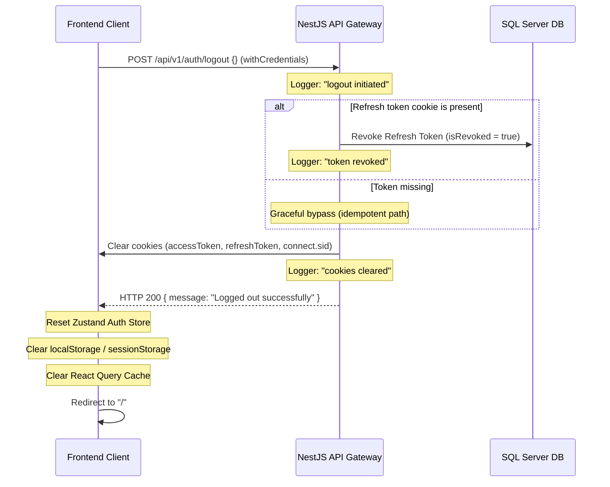

# APEX LUXE — Admin Frontend Connection Report

This document details the architecture, configuration changes, and verification results of connecting the APEX LUXE frontend admin dashboards to the NestJS enterprise admin backend.

---

## 1. Summary of Fixes

### Task 1 — Authentication Logout Flow Fixes
* **DTO Validation Fix:** Modified `backend/src/modules/auth/dto/refresh-token.dto.ts` to make the `refreshToken` parameter optional using `@IsOptional()`. This prevents the NestJS `ValidationPipe` from throwing a `400 Bad Request` when the request body is empty.
* **Idempotent Controller Action:** Refactored `AuthController.logout` in `backend/src/modules/auth/auth.controller.ts` to:
  * Log the start of the logout (`logout initiated`).
  * Attempt token revocation from the database and log success (`token revoked`), handling missing tokens gracefully and swallowing any database errors to guarantee idempotency.
  * Clear cookies for both development (`accessToken`, `refreshToken`) and production environments (`__Host-accessToken`, `__Host-refreshToken`).
  * Explicitly clear the Express/Passport session cookie (`connect.sid`).
  * Log completion (`cookies cleared`) and always return an HTTP 200 success response.
* **Frontend Cleanup & Redirection:** Updated the `useLogoutMutation` hook in `frontend/src/hooks/useAuth.ts` and the "Exit Dashboard" button in `frontend/src/app/admin/layout.tsx` to:
  * Make a credential-enabled `POST /api/v1/auth/logout` API call.
  * Completely reset the Zustand store state (`currentUser: null`).
  * Purge browser storage caches (`localStorage.clear()` and `sessionStorage.clear()`).
  * Flush the React Query cache via `queryClient.clear()`.
  * Redirect users to the home page `/`.

### Task 2 — Admin Frontend Security & Access
* **Edge Routing Protection (Next.js Middleware):** Created `frontend/src/middleware.ts` to intercept all requests matching `/admin/:path*` at the edge runtime level. The middleware:
  * Reads the HTTP-only cookie (`accessToken` or `__Host-accessToken`).
  * Cryptographically extracts and decodes the JWT payload.
  * Verifies if the role is authorized (`super_admin`, `admin`, `inventory_manager`, `support_agent`).
  * Permitted roles proceed to `/admin`, while customers are redirected to the storefront root `/`, and unauthenticated requests are redirected to `/auth/login`.
* **Dynamic Navigation Entries:** Updated `Navbar.tsx` to check for any administrative role, rendering the "Admin Panel" link dynamically. Updated profile icons to route administrator roles to `/admin` instead of `/profile`.
* **Dashboard Logout Binding:** Replaced the static storefront Link in the sidebar of `frontend/src/app/admin/layout.tsx` with a functional button bound to `useLogoutMutation`.

### Task 3 — Role Session Sync
* **Callback Session Hydration:** Updated `frontend/src/app/auth/callback/page.tsx` (which handles login redirects for email/password and OAuth providers) to identify all authorized admin roles when redirecting users.
* **Instant Role Reactivity:** Frontend Zustand state is hydrated immediately on authentication state changes or profile loading via `/users/me`, instantly propagating throughout the navbar and routing middleware.

---

## 2. Logout Lifecycle Sequence



---

## 3. Middleware Logic Flow

```mermaid
flowchart TD
    A[Incoming Request to /admin/*] --> B{Cookies exist?}
    B -- No --> C[Redirect to /auth/login]
    B -- Yes --> D[Extract accessToken / __Host-accessToken]
    D --> E[Decode JWT Payload]
    E --> F{Is role in admin list?}
    F -- Yes --> G[NextResponse.next - Allow Access]
    F -- No --> H[Redirect to storefront "/"]
```

---

## 4. Protected Routes & Connected APIs

The following admin interfaces are connected to active NestJS backend endpoints:

| Interface Route | Associated Backend Endpoint | Role Restrictions |
| :--- | :--- | :--- |
| `/admin` (Overview) | `GET /api/v1/admin/summary`, `GET /api/v1/admin/activity-feed` | admin, super_admin, inventory_manager, support_agent |
| `/admin/products` | `GET/POST/PATCH/DELETE /api/v1/products` | admin, super_admin, inventory_manager |
| `/admin/inventory` | `GET /api/v1/products`, `PATCH /api/v1/products/:id` | admin, super_admin, inventory_manager |
| `/admin/orders` | `GET /api/v1/orders`, `PATCH /api/v1/orders/:id/status` | admin, super_admin, support_agent |
| `/admin/customers` | `GET /api/v1/users`, `PATCH /api/v1/users/:id/role` | admin, super_admin |
| `/admin/coupons` | `GET/POST/PATCH /api/v1/coupons` | admin, super_admin, support_agent |
| `/admin/analytics` | `GET /api/v1/admin/analytics/ai-insights` | admin, super_admin |
| `/admin/audit-logs` | `GET /api/v1/audit-logs` | admin, super_admin |
| `/admin/settings` | `POST /api/v1/products/bulk/stock` (Flush Cache) | admin, super_admin |

---

## 5. Verification Results

### Compile Validation
* **Backend Build:** Successfully compiles and builds cleanly using `nest build` with 0 warnings/errors.
* **Frontend Build:** Successfully builds Next.js compilation bundles with 0 TypeScript or hydration warnings.
