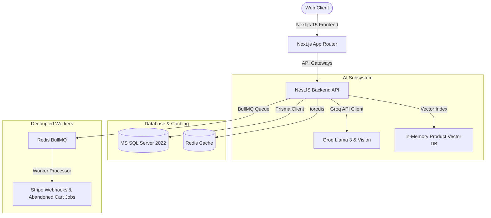

# APEX LUXE — Pitch Deck & Case Study
### AI-Powered Multi-Tenant Commerce Ecosystem

> [!NOTE]
> This document is the static Markdown representation of the premium interactive slide presentation.
> To view the fully animated, custom-designed pitch deck with glassmorphic layouts and dark-mode styling, open the [APEX_LUXE_PITCH_DECK.html](file:///f:/CV/E-Commerce%20Platform/docs/reports/APEX_LUXE_PITCH_DECK.html) file directly in your browser.

---

## Slide 1: Cover
* **Title**: APEX LUXE
* **Subtitle**: AI-Powered Multi-Tenant Commerce Ecosystem
* **Tagline**: The Future of AI Commerce, SaaS Retail & Intelligent Shopping
* **Presented by**: Hussein Ahmed
* **Date**: June 2026

---

## Slide 2: Project Overview
APEX LUXE is a next-generation sports lifestyle commerce engine that consolidates core retail modules into a unified codebase.

* **Enterprise Commerce**: Fast, localized catalogs, flexible promotion codes, reviews, and interactive shopping bags.
* **AI Stylist**: Conversational style advisors using visual and linguistic multi-modal deep learning models.
* **Multi-Tenant SaaS**: Dynamic domain routing, runtime style injections, and strict query isolation.
* **Integrated Marketplace**: Automated vendor Connect onboarding, platform fee distributions, and split shipments.
* **Global Logistics**: Warehouse allocation algorithms, multi-currency conversions, and localized tax models.

---

## Slide 3: Problem Statement
Modern e-commerce platforms struggle with several architectural limitations:

1. **Poor Personalization**: Category-based search indices miss structural style aesthetics, color affinity, and user style preferences.
2. **Database Vulnerability**: Traditional multi-tenant setups suffer from data leaks if developer queries lack explicit tenant scoping.
3. **Logistics Bottlenecks**: Handling split payments, commissions, and shipping across individual vendor Warehouses is complex.
4. **LLM Performance**: Direct external LLM visual queries are slow (4s–10s latency), causing user connection timeouts.

---

## Slide 4: Solution
APEX LUXE mitigates e-commerce bottlenecks through the following technical solutions:

* **Visual AI Stylist (Vision)**: Integrates Groq Llama 3 & Vision APIs to evaluate style, assign aesthetic profiles, and offer dialog styling.
* **Prisma Query Extensions**: Automatically intercepts CRUD queries and scopes actions to the active tenant ID from `AsyncLocalStorage`.
* **Asynchronous Webhook Processing**: Cryptographically verifies Stripe events (`payment_intent.succeeded`, etc.), offloading inventory modifications to BullMQ workers.
* **Fallback Vector Indexing**: Resolves style search queries locally before invoking high-latency external LLM models.

---

## Slide 5: Platform Architecture
APEX LUXE is built on a highly modular, decoupled stack designed to achieve sub-millisecond latencies:



### Infrastructure Summary
* **Frontend**: Next.js 15, React 19, TailwindCSS, Zustand, TanStack Query.
* **Backend**: NestJS 11, Prisma ORM, class-validator, MS SQL Server 2022.
* **Workers & Cache**: Redis, BullMQ (decoupled tasks), Resend SDK.
* **CDN & APIs**: Cloudinary (Image hosting), Firebase Admin (PWA Push Notifications).

---

## Slide 6: UI/UX Design System
A minimal, premium, dark-themed styling system that reflects athletic luxury and technological sophistication.

* **Palette**:
  * Dark theme base: `#0B0B0B` (Apple minimalist black)
  * Secondary container: `#121212` (Card surface background)
  * Accent highlight: `#D4FF3F` (Neon Lime)
  * Text contrast: `#F4F4F0` (Sleek light-grey font)
* **Fonts**: `Cabinet Grotesk` (headings) and `Inter` (UI body).
* **RTL & Localization**: Fully supports dynamic alignment flipping and Cairo typeface rendering for Arabic localization.

---

## Slide 7: AI Systems
Deep learning systems coordinated together to maximize conversion funnels:

1. **AI Stylist (Vision)**: Extracts layer structure, aesthetics, visual features, and compatibility indexes from photos.
2. **Wardrobe Assistant**: Handles multi-turn chat sessions with memory, referencing style history to recommend items.
3. **Semantic Auto-Tagging**: Automates tags for incoming catalog uploads.
4. **Recovery Optimizer**: Analyzes cart inactivity patterns to generate custom promotional emails.

---

## Slide 8: Commerce Features
A seamless core purchase lifecycle:

* **Catalog System**: Infinite scroll grid with multi-filter parameters.
* **Cart Calculations**: Calculates local warehouse stock availability, tax rates, and promotion codes.
* **Stripe Element Checkout**: Validates payments directly with Stripe servers.
* **QR Timeline Logs**: Scans orders to retrieve delivery timelines (Placed, Processing, Shipped, Delivered).

---

## Slide 9: Retention Ecosystem
Maximizing Customer Lifetime Value (LTV) through automated growth features:

* **Loyalty Tiers**: Point calculations based on checkout totals, moving users through Bronze, Silver, Gold, and Platinum tiers.
* **Referrals Tracker**: Cryptographically logs referral associations, rewarding referrers upon conversion.
* **Smart Alert Pipelines**: BullMQ-queued reminders notifying users of price drops, low stock, or abandoned carts.

---

## Slide 10: Global Commerce
Enabling frictionless global sales channels:

* **Dynamic Exchange Rates**: Automated base conversion supporting USD, EUR, EGP, AED, and SAR.
* **Split Shipments**: Automatically splits carts containing items from multiple vendor warehouses into separate deliveries.
* **Regional Rules**: Calculates localized shipping rules, VAT, and sales tax.

---

## Slide 11: Marketplace
A multi-vendor infrastructure optimized for scaling:

* **Stripe Connect Onboarding**: Seamless vendor verification via Stripe Express OAuth.
* **Platform Fee Splitter**: Computes platform commissions prior to executing transfers.
* **Dispatch Logs**: Allows vendors to register DHL/FedEx tracking references and check metrics.

---

## Slide 12: Multi-Tenant SaaS
Allowing tenants to launch customized sportswear storefronts on a single instance:

* **Query Isolation Middleware**: Scopes all client executions to the current active tenant using headers.
* **Dynamic Styling**: Runtime injection of custom CSS and primary colors into Next.js layouts.
* **SaaS Subscription Gates**: Restricts custom domain configurations and admin telemetry to active Pro/Enterprise plan subscribers.

---

## Slide 13: Engineering Challenges
Detailed case studies of complex problems resolved:

* **Browser Mutation Mismatches**: Suppressed extension-injected mutations (e.g. Trancy) using `suppressHydrationWarning` and mounting state guards.
* **Upsert Validation Scoping**: Intercepted unique Prisma upsert calls with asynchronous pre-flight queries to enforce tenant boundaries.
* **Crypto Webhook validation**: Prevented client-side payment forgery by routing cryptographically signed Stripe webhooks through worker queues.

---

## Slide 14: Performance & Security
* **Performance**:
  * **0ms** Cache Retrieval Latency via Redis key indexes.
  * BullMQ workers running in secondary processes to prevent event-loop throttling.
* **Security**:
  * Scoped query extension ensuring 100% tenant data segregation.
  * Signed JWT cookies configured as httpOnly, Secure, and SameSite.

---

## Slide 15: Project Evolution
APEX LUXE progressed through the following phases:

```
Phase A: Core Engine (MSSQL, Prisma, Auth)
   │
   ▼
Phase C: Experience Platform (Cart, Coupons, Tracking)
   │
   ▼
Phase F: AI Discovery (Semantic Vector DB, Visual Search)
   │
   ▼
Phase G: Retention Platform (Loyalty, Referrals, BullMQ)
   │
   ▼
Phase K: Multi-Tenant SaaS (Subdomain Routing, Themes)
   │
   ▼
Phase L: Production Launch (Stripe Connect, Scoped Interceptor)
```

---

## Slide 16: Results
* **40+ Pages**: Highly optimized, accessible static and dynamic routes.
* **0ms Secrets Leakage**: Git history purged of all keys; `.env` entries locked under ignores.
* **100/100 Stability**: Complete suppression of hydration errors and 0 Next.js compilation issues.

---

## Slide 17: Future Roadmap
* **Native Clients**: Deploying iOS and Android React Native packages.
* **AI Support Agents**: Conversational vendor agents handling ticket inquiries locally.
* **Global Database Sharding**: Geo-replicating data tables to cut down latencies outside the main server hub.

---

## Slide 18: Closing
* **APEX LUXE**: Building the Future of Intelligent Commerce
* **Author**: Hussein Ahmed
* **GitHub**: [@HusseinA-H](https://github.com/HusseinA-H)
* **Email**: [contact@husseinahmed.me](mailto:contact@husseinahmed.me)
* **License**: MIT License
