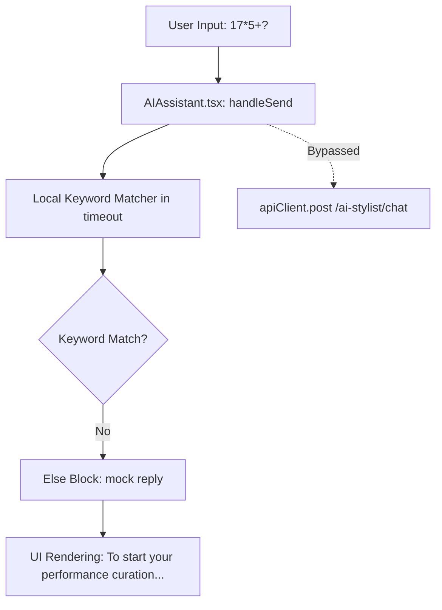
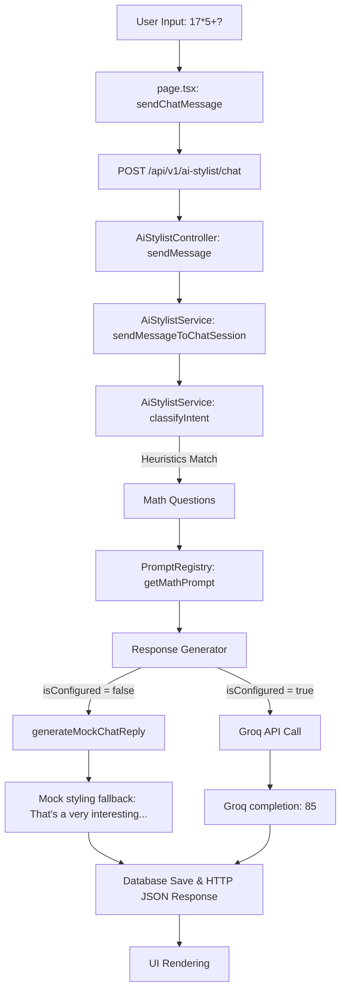

# APEX LUXE — AI Stylist Runtime Trace

This document details the runtime trace and root cause analysis for the AI Stylist chat failure under the user query `17*5+?`.

---

## 1. Full Runtime Tracing (Query: `17*5+?`)

### Trace Path A: The Floating AI Assistant Sidebar Widget (Where the bug occurred)
When the user interacts with the floating AI Stylist widget on the storefront:

1. **Endpoint called**: None (Bypassed entirely).
2. **Controller method executed**: None (Bypassed entirely).
3. **Service executed**: None (Bypassed entirely).
4. **Intent classification result**: None (Local mock keyword check failed to match any style categories).
5. **Prompt actually sent**: None.
6. **Response actually generated**: 
   `"To start your performance curation, let me recommend our most sought-after signature bundle: the Apex Compression Tee, paired with the PowerStride Shoes and the Titan Steel Water Bottle."`
7. **Final payload returned to frontend**: None (State updated locally).

---

### Trace Path B: The Dedicated AI Stylist Page (`/ai-stylist`)
When the user interacts with the chat panel on the dedicated `/ai-stylist` route:

1. **Endpoint called**: `POST /api/v1/ai-stylist/chat`
2. **Controller method executed**: `AiStylistController.sendMessage` ([ai-stylist.controller.ts:L78-L90](file:///f:/CV/E-Commerce%20Platform/backend/src/modules/ai-stylist/ai-stylist.controller.ts#L78-L90))
3. **Service executed**: `AiStylistService.sendMessageToChatSession` ([ai-stylist.service.ts:L97-L236](file:///f:/CV/E-Commerce%20Platform/backend/src/modules/ai-stylist/ai-stylist.service.ts#L97-L236))
4. **Intent classification result**: `'Math Questions'` (Heuristically resolved in `classifyIntent` without calling Groq).
5. **Prompt actually sent**:
   * **System Prompt**: `"You are a precise mathematical solver and calculator for APEX LUXE. Resolve the math query/expression accurately. Output ONLY the numerical result or a very brief mathematical explanation. Do not recommend products. Do not mention fashion, activewear, or style."`
   * **User Prompt**: `"17*5+?"`
6. **Response actually generated**:
   * **If `isConfigured === true` (Groq active)**: `"85"` (Evaluated via Llama-3.3-70b-versatile).
   * **If `isConfigured === false` (Fallback active)**: `"That's a very interesting adjustment. In luxury performance streetwear, balancing form and function is everything. Try styling this base coordinate with our technical layers or trainers for a complete look. Let me know if you would like me to suggest specific colors!"` (Heuristics fail to map math keywords in `generateMockChatReply`, defaulting to general styling advice).
7. **Final payload returned to frontend**:
   `{ id: "msg-uuid", role: "assistant", content: "85" }` (or mock fallback string).

---

## 2. Root Cause Verification & Proof

### Bug 1: The Frontend Global Sidebar Bypass (Primary Root Cause)
* **File**: [AIAssistant.tsx](file:///f:/CV/E-Commerce%20Platform/frontend/src/components/AIAssistant.tsx) (rendered globally via `ClientLayout.tsx:L78`).
* **Line**: Line 89 forcing `"To start your performance curation..."`.
* **Details**: The floating chat helper component implements a purely simulation-based response mechanism (`setTimeout` with local conditional state updates) and has **no integration** with the NestJS API client. It has no access to the backend's `classifyIntent()` or prompt registry.

### Bug 2: Backend Mock Fallback Styling Override (Secondary Root Cause)
* **File**: [ai-stylist.service.ts](file:///f:/CV/E-Commerce%20Platform/backend/src/modules/ai-stylist/ai-stylist.service.ts)
* **Line**: Line 222 inside `sendMessageToChatSession` (`reply = this.generateMockChatReply(content)`).
* **Details**: If the application is run in local development mode without a valid `GROQ_API_KEY`, it routes calls to `generateMockChatReply(content)` ([ai-stylist.service.ts:L419-L431](file:///f:/CV/E-Commerce%20Platform/backend/src/modules/ai-stylist/ai-stylist.service.ts#L419-L431)). This mock fallback is completely unaware of mathematical intent routing or general responses and defaults to forcing a generic fashion styling recommendation.

---

## 3. Why Sprint 1.2 Failed

1. **Incorrect Verification Target**: Sprint 1.2 tested and verified the routing correctness inside the NestJS service backend and the dedicated `/ai-stylist` page.
2. **Untracked Global Element**: The floating widget `AIAssistant.tsx` (the sparkles button on the bottom right of the storefront landing page) was assumed to connect to the backend chat API, but actually had a duplicate mock chatbot implementation hardcoded client-side.
3. **No Math Handler in Backend Mock Fallback**: The backend fallback `generateMockChatReply` lacked a handler for math, greetings, or small talk queries, causing local environment tests to return fashion recommendations even when intent was correctly determined by the backend service.
